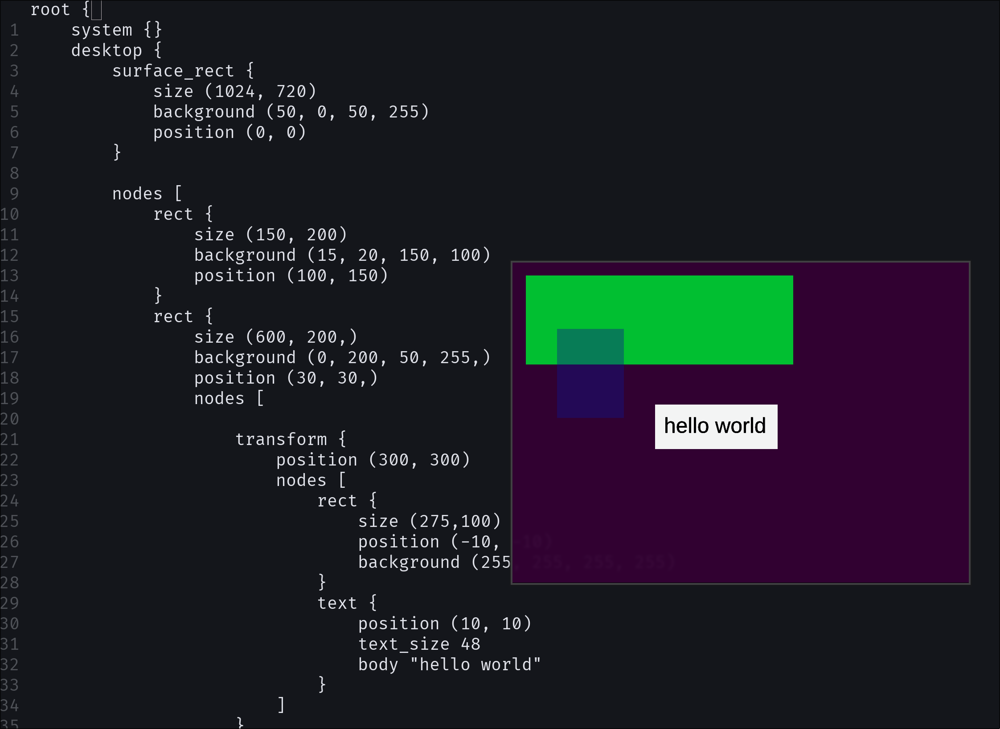

# Swen

Swen is an experimental compositor aimed at providing native vector-based rendering which apps can access using a simple markup-based DSL. 

## Premise

Swen is inspired by the NeWS operating system and informed by modern UI frameworks like Flutter. By offloading graphics runtime from the app to the compositor, native apps no longer need their own graphics runtime or frame loop. Since rendering for most UI only needs to happen upon state change, a system of caching and diffing should allow noticeable resource efficiency compared to X11 or Wayland. 

The backend takes a hybrid approach. Native apps are rendered by Pathfinder taking a vector-based approach. The CPU will handle scheduling while pathfinder will take advantage of GPU acceleration. Since changes are based on diffs that apps pass to the compositor, rerendering only needs to be done on change and only to dirty regions. Tiles can be further cached and sorted, and approach used by Skia. If you need more flexibility, or you want to use a non-native app, the compositor would render it in a wayland surface treated like an opaque texture. 

## Architecture

The compositor reads a form of markup written as a .swen file. This is parsed into an AST and made into a global scene tree much like Flutter. When an app is launched which provides a .swen file, it is parsed and inserted into the scene tree. The apps UI is sandboxed from writing to other apps, and is limited to receiving events which are explicitly requested within its scene tree. A low level IR is provided so apps can easily push changes, to the scene tree, including transformations.

## Proposed Benefits

All benefits are hypothetical until proven, but are based on well-tested and modern UI paradigms. 

### Performance

- Render-on-change instead of render-on-frame. 
- Global batching & caching.
- Avoid redundant GPU state changes.
- Better rendering consistency across DPIs and resolutions.

### Customization

- Programmable window management.
- Native theming.
- Inspectors, debuggers, and live editors can operate directly on the scene tree.

### Backwards Compatibility

- Legacy apps still run normally.
- Incremental usage (write UI around a wayland surface).
- Pipeline is not dependent on backend and can evolve independently of Swen.
- Porting apps does not require bundling a graphics runtime or framework.
